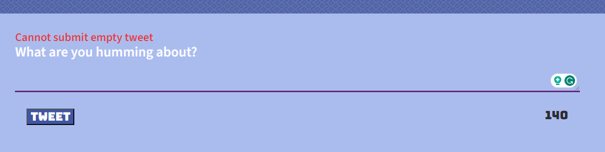

# Tweeter Project
a social netWork where you can share your tweets with friends

## Getting Started

1. [Create](https://docs.github.com/en/repositories/creating-and-managing-repositories/creating-a-repository-from-a-template) a new repository using this repository as a template.
2. Clone your repository onto your local device.
3. Install dependencies using the `npm install` command.
3. Start the web server using the `npm run local` command. The app will be served at <http://localhost:8080/>.
4. Go to <http://localhost:8080/> in your browser.
5. Write a tweet not longer then 140 character, yyou have a counter on the rigth.
6. if you try to subnit empty tweet or longer then 140, you will gey eror message
7. you can see how long ago the tweet was publish 
8. the page automatically adjust to your screen size 

## Dependencies

- Express
- Node 5.10.x or above
- body-parser
- chance
- md5
- timeago.js

